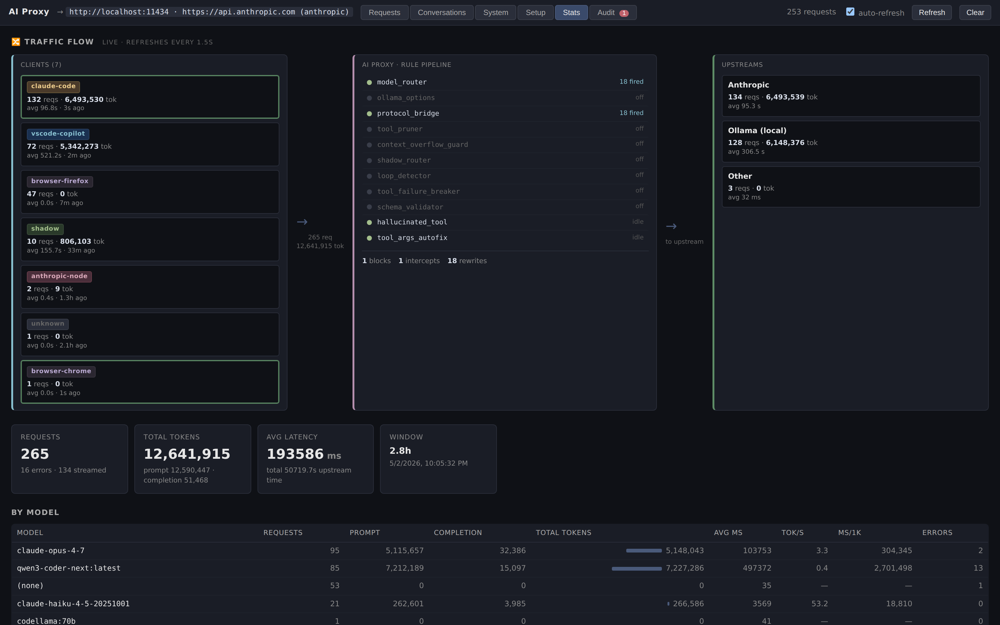
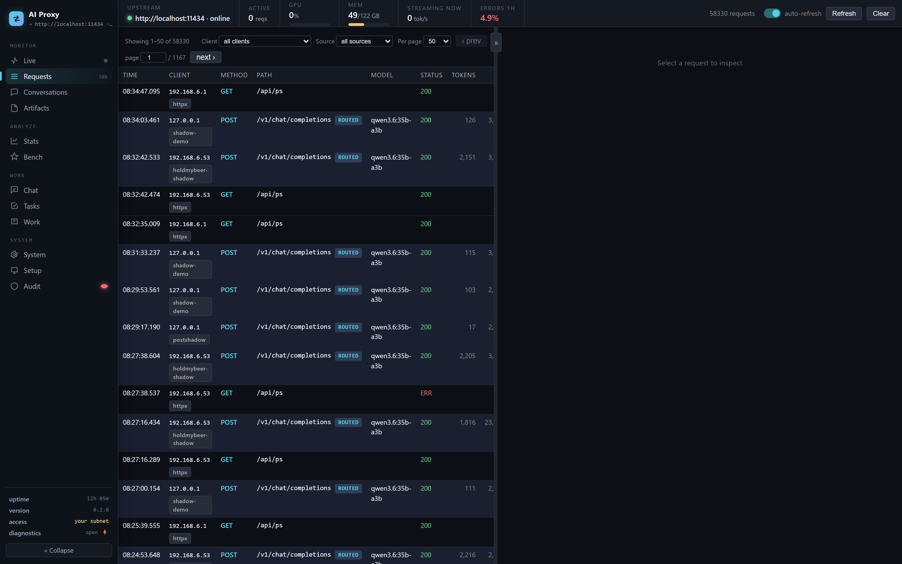
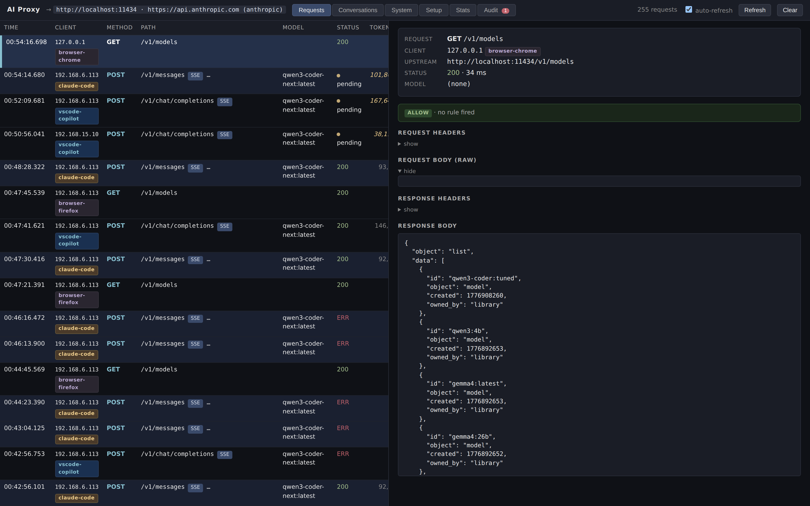
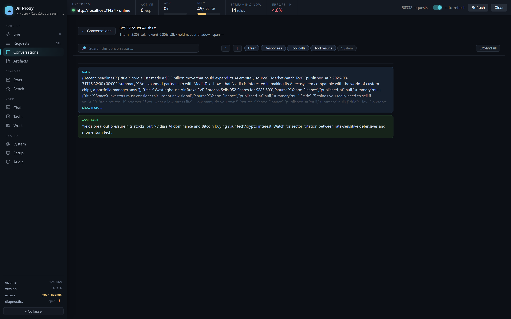
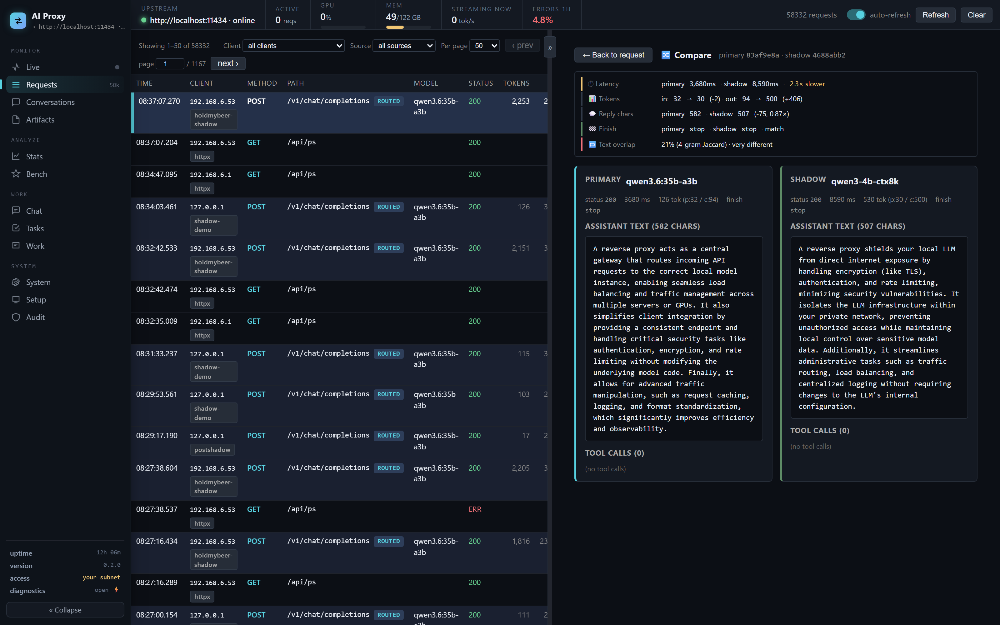
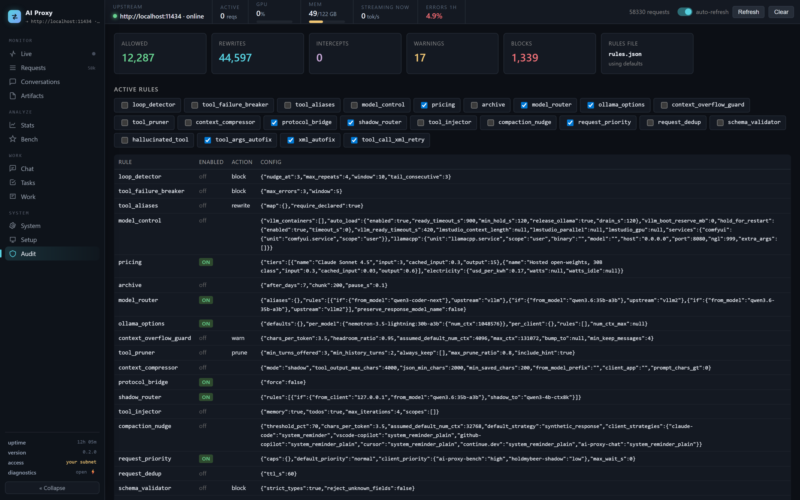
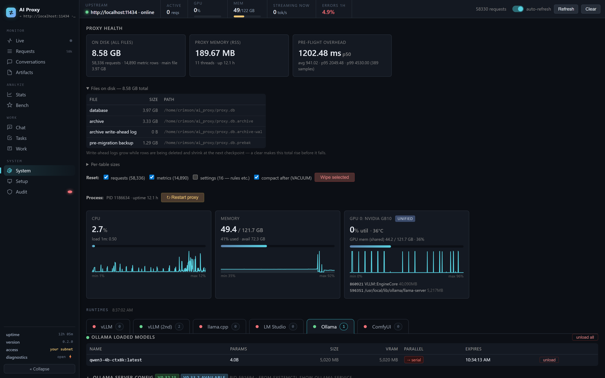

# AI Proxy

A transparent inspector and rule engine that sits between your AI clients (Claude Code, GitHub Copilot Chat, Cursor, raw SDKs) and their upstreams (Anthropic, Ollama, LM Studio, vLLM, anything OpenAI-compatible). Logs every request, surfaces conversations and tool calls, applies configurable rules, and gives you a live web UI to see what's actually happening.

Built around two ideas:

1. **Observability without changing your client** — set `ANTHROPIC_BASE_URL` (or `OPENAI_BASE_URL`, or `OLLAMA_HOST`) to the proxy and every request, response, tool call, token count, and conversation thread is captured automatically.
2. **Rules that improve model behavior** — pre/post-flight hooks catch loops, fix malformed tool calls, prune unused tools, compress bloated context, prevent silent context-window truncation, route requests across models, and more.



---

## Table of contents

- [What it does](#what-it-does)
- [Install](#install)
- [Quick start](#quick-start)
- [The dashboard](#the-dashboard)
- [Configuration](#configuration)
- [Deployment](#deployment)
- [API endpoints](#api-endpoints)
- [MCP integration](#mcp-integration)
- [Architecture](#architecture)
- [Development](#development)
- [Security notes](#security-notes)
- [Troubleshooting](#troubleshooting)

---

## What it does

### Observe

- **Inspect every request** — full bodies, headers, streaming chunks, tool calls, token counts, latency, and the rule verdict that applied. Searchable and filterable by client app. PII-redacted by default for cross-network viewers.
- **Group requests into conversations** — automatic threading by `system + first_user` hash, with a turn-by-turn timeline: in-conversation search, message-type filters (isolate tool calls, results, or responses), collapsible long messages, and a distinguishing snippet on each tool call.
- **Watch traffic live** — the Live View tab shows one tile per active conversation with elapsed time and token counts updating as the model generates. Request detail streams the reconstructed output while the request is still in flight.
- **Identify the client app** — distinguishes Claude Code, VS Code Copilot Chat, Cursor, Continue, Cline, Anthropic SDK, OpenAI SDK, LangChain, Hermes Agent, browsers, etc. via header, User-Agent, and system-prompt fingerprinting.
- **Track artifacts** — every file, URL, directory, and image the model touched through a tool call, extracted from request bodies and aggregated by path. Drill down by conversation, browse the file tree, see each write's content size, and read the captured content inline.
- **Aggregate stats** — per-model, per-client, per-app, per-tool counts, tokens, latency percentiles, and throughput, plus trend charts over time.
- **System metrics** — CPU, memory, GPU utilization and VRAM, loaded models on Ollama / LM Studio / vLLM, Ollama's server config, and an update check against a minimum version.

### Intervene

- **Translate Anthropic ↔ OpenAI** — point Claude Code at any OpenAI-compatible backend (Ollama, LM Studio, vLLM). The proxy translates request/response bodies and SSE streams in both directions.
- **Route across models and upstreams** — conditional rules on model name, prompt size, tool presence, image presence, client IP, or path, sending the rewritten request to Ollama, LM Studio, or vLLM.
- **Rule pipeline** — pluggable pre-flight (block/warn/transform) and post-flight (intercept/autofix) rules with a JSON editor and quick-toggle UI. Changes apply on the next request; no restart.
- **Compress context** — a deterministic compressor squeezes bulky tool outputs and JSON blobs already in the history, with a shadow mode that measures the savings before you commit to it.
- **Handle model quirks** — per-model reasoning control (force thinking off, make it opt-in, or leave it alone) and system nudges, matched by model-name pattern and hot-reloaded from a JSON file.
- **Shadow runs** — send the same request to a primary upstream *and* a local model in parallel, store both, and get an automatic side-by-side comparison (latency delta, token delta, tool-call agreement, text similarity).
- **Take control** — kill a specific in-flight request to free the GPU slot, or flip panic mode to 503 all proxied traffic while keeping the dashboard up.

### Automate

- **Auditor suggestions** — the proxy analyzes recent traffic and recommends config changes (route slow-short requests off Opus, prune unused tools, bump `OLLAMA_NUM_PARALLEL`, etc.).
- **Benchmarks** — compare models on speed *and* correctness. Sweep models × context sizes × thinking modes × temperatures in one submission; grade the output against executable task suites; isolate the GPU for clean numbers. Reasoning-aware throughout. See [docs/benchmarking.md](docs/benchmarking.md).
- **Scheduled tasks** — queue a prompt to run one-shot or on a schedule (cron expression, or `every 10m` / `every 2h` / `every 1d`), with pause/resume/run-now controls.
- **MCP server** — exposes the same data via Model Context Protocol so an LLM can query traffic patterns directly.
- **Restart from the UI** — one button to bounce the service-managed proxy, with health-check polling for confirmation.

---

## Install

Pick whichever fits. All of them serve the same app; the difference is only how it gets onto the machine.

### npm — self-contained binary, no Python needed

```bash
npm install -g guscatalano-ai-proxy
ai-proxy
```

The launcher package pulls a platform-gated binary (`win32-x64`, `darwin-arm64`, `linux-x64`, `linux-arm64`) frozen with PyInstaller.

### Python

```bash
pipx install guscatalano-ai-proxy   # or: pip install guscatalano-ai-proxy
ai-proxy
```

Requires Python 3.10+. Runtime deps are just FastAPI, uvicorn, and httpx.

### Windows installer

Download `ai-proxy-<version>.msi` from the [latest release](https://github.com/guscatalano/AI_Proxy/releases) and run it, or grab the raw `ai-proxy-win32-x64.exe` and double-click it. An MSIX is also built for Microsoft Store submission.

### Raw binary

Every release attaches a standalone binary per platform — download, `chmod +x`, run. No runtime required.

### From source

```bash
git clone https://github.com/guscatalano/AI_Proxy.git
cd AI_Proxy
python -m venv .venv

# Windows
.venv\Scripts\Activate.ps1
# Linux/macOS
source .venv/bin/activate

pip install -r requirements.txt
python -m ai_proxy
```

### Docker

```bash
docker compose up -d          # UI at http://localhost:8000/__proxy/
```

State (DB, rules, generated images) persists in the `ai-proxy-data` volume. The compose file reaches an Ollama on the host via `host.docker.internal`; edit `OLLAMA_URL` / `ANTHROPIC_URL` for your setup. Or without compose:

```bash
docker build -t ai-proxy .
docker run -d -p 8000:8000 -v ai-proxy-data:/data \
  -e OLLAMA_URL=http://host.docker.internal:11434 \
  --add-host host.docker.internal:host-gateway ai-proxy
```

---

## Quick start

### Prerequisites

An upstream to forward to — Ollama on `localhost:11434`, LM Studio, vLLM, the Anthropic API, or anything OpenAI-compatible.

No upstream yet? The fastest local one is [Ollama](https://ollama.com):

```bash
ollama pull llama3.2   # a small model to test with
# Ollama serves on :11434 automatically after install
```

### Run it

```bash
ai-proxy
```

UI: <http://127.0.0.1:8000/__proxy/>

There are no command-line flags — everything is configured by environment variable (see [Configuration](#configuration)) or live from the dashboard.

### Verify it's working

The dashboard is empty until traffic flows through it. With an upstream running, send one request and watch it land in the **Requests** list:

```bash
# OpenAI-compatible upstream (Ollama / LM Studio / vLLM)
curl http://localhost:8000/v1/chat/completions \
  -H 'content-type: application/json' \
  -d '{"model": "llama3.2", "messages": [{"role": "user", "content": "say hi"}]}'
```

The call appears with its client badge, tokens, latency, and full request/response body. Nothing shows up? See [Troubleshooting](#troubleshooting).

### Point your client at the proxy

```bash
# Claude Code (and any Anthropic SDK client)
export ANTHROPIC_BASE_URL=http://localhost:8000
claude

# OpenAI SDK / VS Code Copilot Chat / Cursor / Continue / Cline
export OPENAI_BASE_URL=http://localhost:8000/v1
# or set the equivalent in the client's settings

# Ollama-native clients
export OLLAMA_HOST=http://localhost:8000
```

The proxy routes by path: `/v1/messages*` and `/v1/complete*` go to Anthropic (`ANTHROPIC_URL`); everything else (`/v1/chat/completions`, `/api/*`) goes to Ollama (`OLLAMA_URL`). Rules can override that per request.

The **Setup** tab in the dashboard has copy-paste snippets for the common clients.

---

## The dashboard

Everything lives under `/__proxy/`. The navigation rail groups the views; on a phone it collapses into a slide-over drawer.

| View | What's in it |
|---|---|
| **Live** | One tile per active or recently-finished conversation, with live elapsed time and token counts. Full-window mode for a wall display. |
| **Requests** | Every proxied call, filterable by client app and searchable, with page-jump. Click through for bodies, headers, streaming chunks, gate verdict, thinking badge, images, and live output while streaming. |
| **Conversations** | Threaded turns grouped by `system + first_user`, with a dedicated page per conversation: search, message-type filters, and collapsible long messages. |
| **Artifacts** | Files, URLs, directories, and images touched via tool calls — by conversation, by folder, or ranked by activity, with inline content viewing and per-write content sizes. |
| **Stats** | KPI strip plus a tabbed breakdown by model, client, app, and tool; a Trends tab with per-chart enlarge. |
| **Audit** | Gate verdict log, the rules editor, routing-mode toggle, and the auditor's automatic suggestions. |
| **System** | CPU, memory, GPU, loaded models per upstream, Ollama config and update check, access badge, and the restart button. |
| **Bench** | Queue and inspect benchmark runs and sweeps, with graded quality scoring and N-way comparison. |
| **Tasks** | One-shot and scheduled prompt runs. |
| **Chat** | A minimal chat client that talks through the proxy, so you can exercise a model without another tool. |
| **Setup** | Client configuration snippets. |

### Screenshots

#### Requests list — every API call, with client app badges


#### Request detail — body, response, headers, gate verdict, downsize heuristic


#### Conversations — threaded turns with TOC navigation


#### Shadow comparison — side-by-side primary vs local model


#### Audit tab — routing toggle, rule editor, automatic suggestions


#### System — CPU, memory, GPU, loaded models, restart button


---

## Configuration

### Environment variables

#### Upstreams

| Variable | Default | What it does |
|---|---|---|
| `OLLAMA_URL` | `http://localhost:11434` | OpenAI-compat / Ollama upstream (the default for everything but Anthropic paths) |
| `ANTHROPIC_URL` | `https://api.anthropic.com` | Anthropic upstream for `/v1/messages*` and `/v1/complete*` |
| `LMSTUDIO_URL` | `http://localhost:1234` | LM Studio — a `model_router` routing target and a System-tab source |
| `VLLM_URL` | `http://localhost:8001` | vLLM — same |
| `VLLM2_URL` | `http://localhost:8002` | A second vLLM on its own port, so two models can be resident at once. A full twin of the first: routable as upstream `vllm2`, start/stop and auto-load resolve the container publishing *this* port |
| `SD_URL` | `http://localhost:8188` | ComfyUI endpoint for the txt2img helper |
| `SD_MODEL` | (none) | Checkpoint name for that helper |
| `ANTHROPIC_API_KEY` | (none) | Used for proxy-originated Anthropic calls (client keys pass through untouched) |
| `BRAVE_SEARCH_API_KEY` | (none) | Enables the server-side `web_search` tool |

#### Server

| Variable | Default | What it does |
|---|---|---|
| `PROXY_HOST` | `0.0.0.0` | Bind address (use `127.0.0.1` for local-only) |
| `PROXY_PORT` | `8000` | Bind port |
| `PROXY_HTTPS_PORT` | `0` | Second HTTPS listener on the same app; `0` disables it |
| `PROXY_SSL_CERT` / `PROXY_SSL_KEY` | (none) | Cert and key for that listener — both required, plus a non-zero HTTPS port |
| `PROXY_SSL_KEY_PASSWORD` | (none) | Passphrase for an encrypted key |
| `PROXY_GRACEFUL_SHUTDOWN` | `10` | Seconds uvicorn waits for connections to drain, so a lingering SSE stream can't hang a restart |
| `PROXY_STARTUP_TIMEOUT_S` | `120` | How long the HTTPS listener waits for HTTP startup (migrations, backfills) before refusing to start. Raise it if startup is legitimately slow; it never opens HTTPS against a half-initialised app |

#### State

| Variable | Default | What it does |
|---|---|---|
| `PROXY_STATE_DIR` | platform-specific | Where writable state lives. `%LOCALAPPDATA%\ai-proxy` on Windows, `$XDG_DATA_HOME/ai-proxy` or `~/.local/share/ai-proxy` elsewhere |
| `PROXY_DB` | `<state dir>/proxy.db` | SQLite DB path (an existing `./proxy.db` is honored first, so source installs keep their data) |
| `PROXY_RULES_FILE` | `<state dir>/rules.json` | Rules config file |
| `PROXY_MODEL_QUIRKS` | `<state dir>/model_quirks.json` | Per-model quirk overrides, merged over the built-in defaults and hot-reloaded on change |

#### Data growth and retention

| Variable | Default | What it does |
|---|---|---|
| `PROXY_MAX_STORED_BODY` | `4194304` (4 MB) | Cap on persisted body size per request; `0` = unlimited |
| `PROXY_REQUEST_RETENTION_DAYS` | `30` | Prune requests older than this; `0` = keep forever |
| `PROXY_ANALYTICS_CACHE_TTL` | `5` | Seconds to memoize the expensive stats/suggestions endpoints |
| `PROXY_METRICS_INTERVAL` | `5` | Seconds between system-metric samples |
| `PROXY_METRICS_RETENTION` | `86400` | Seconds of metric history to keep |
| `PROXY_INFLIGHT_MAX_S` | `1800` | Age at which a stuck in-flight request is treated as a zombie and reaped |

#### Privacy and access

| Variable | Default | What it does |
|---|---|---|
| `PROXY_REDACT_PII` | `1` | Redact bodies/headers from cross-subnet viewers (toggleable at runtime from the UI) |
| `PROXY_REDACT_SUBNET_BITS` | `24` | IPv4 subnet width for the PII gate |
| `PROXY_ADMIN_IPS` | (none) | Comma-separated IPs that always see full bodies |
| `PROXY_ARTIFACTS` | `1` | Record files/URLs/directories touched via tool calls. Set `0` to capture nothing at all (toggleable at runtime from the Artifacts tab) |
| `MCP_ALLOW_WRITE` | `false` | Allow the `update_rules` MCP tool |
| `MCP_API_KEY` | (none) | Bearer token required on the MCP endpoint |

#### Upstream management

| Variable | Default | What it does |
|---|---|---|
| `PROXY_OLLAMA_MIN_VERSION` | `0.21.0` | Version floor for the System tab's update check |
| `OLLAMA_SYSTEMD_UNIT` | `ollama.service` | Unit name used when reading Ollama's server config |

### Rule pipeline

All rules live in a single JSON object, edited in **Audit → Rules Editor** (or POSTed to `/__proxy/api/rules`). Saves apply on the next request — no restart. Every rule is off by default except `protocol_bridge` and `loop_detector`.

| Rule | Phase | What it does |
|---|---|---|
| `model_router` | transform | Rewrite `model` based on conditions (from_model, prefix, client IP, prompt size, has_tools, has_images, path). Optionally send the result to a different upstream. |
| `ollama_options` | transform | Fill in generation options (`num_ctx`, `keep_alive`, `temperature`, …) the client didn't set — global, per-model, per-client, or rule-matched. `num_ctx_max` is a hard ceiling applied even to client-set values. |
| `protocol_bridge` | transform | Translate Anthropic-shape requests to OpenAI shape when the target model isn't a Claude model, and translate the SSE stream back. `force: true` bridges unconditionally. **On by default.** |
| `tool_pruner` | transform | Drop tool definitions the model has been offered repeatedly but never invoked in this conversation. |
| `context_compressor` | transform | Squeeze bulky tool outputs and large JSON blobs already in the history. `shadow` mode measures the savings without changing the request; `live` mode applies them. |
| `context_overflow_guard` | transform | Estimate prompt tokens and react when they exceed the effective context window — warn, bump `num_ctx`, trim oldest messages, or block with 413. |
| `compaction_nudge` | transform | Past a percentage of the context window, nudge the client to compact — a `<system-reminder>` for Claude Code, plain text for others, or a synthetic response — plus an `X-Proxy-Suggest: compact` header. |
| `tool_injector` | transform | Add proxy-owned tools (`memory`, `todos`) to outgoing requests and execute them server-side, looping the results back to the model. Scopable per client. |
| `shadow_router` | fan-out | Send a parallel shadow request to a comparison model. Best-effort; never blocks or alters the primary. |
| `request_dedup` | fan-out | Tee a duplicate streaming request off the first one's response instead of re-running it upstream. |
| `request_priority` | queue | Per-bucket concurrency caps (high/normal/low) resolved from an `X-Priority` header, a client map, or a default, so low-priority traffic queues at the proxy instead of piling onto the GPU. |
| `loop_detector` | pre-flight | Block when the same tool call repeats too often. Resets on user intervention and explains the block. **On by default.** |
| `tool_failure_breaker` | pre-flight | Block when a tool returns N consecutive errors. |
| `tool_call_xml_retry` | pre-flight | On an upstream "XML syntax error" tool-parse failure, silently retry with a corrective hint telling the model exactly what it malformed. |
| `schema_validator` | post-flight | Validate tool-call args against the request's tool schemas; replace invalid calls with corrective assistant content. |
| `hallucinated_tool` | post-flight | Reject tool calls naming functions not declared in the request. |
| `tool_args_autofix` | post-flight | Fill in missing required tool-call fields from configured defaults, before validation runs. |
| `xml_autofix` | post-flight | Audit malformed XML in text responses (unclosed tags, unescaped `&`). Detection only in v1. |

### Routing modes

The Audit tab has a one-click toggle between three modes, with auto-detection of the active one:

- **Passthrough** — Anthropic requests go straight to api.anthropic.com.
- **Shadow** — primary still goes to Anthropic; a local model runs in parallel for comparison.
- **Redirect** — Anthropic requests are translated to OpenAI shape and served entirely by the local model.

### Model quirks

Some models need a workaround applied on every request regardless of which client sent it. Those live in `model_quirks.json` (built-in defaults, overridable via `PROXY_MODEL_QUIRKS`, hot-reloaded on file change, inspectable at `GET /__proxy/api/model-quirks`):

```json
{
  "ornith": {
    "match": "prefix",
    "thinking": "default_off_optin",
    "reasoning_control": "chat_template_kwargs.enable_thinking",
    "notes": "Reasoning is opt-in; high/medium reasoning_effort turns it on."
  }
}
```

- `match` — `prefix`, `substring` (default), or `exact` against the model name.
- `thinking` — `force_off` (always inject the disable flag), `default_off_optin` (off unless the client asks for high/medium reasoning effort), or `normal` (don't touch it).
- `system_nudge` — optional text appended to the system prompt for models that need behavioral correction.

---

## Deployment

### Linux (systemd) — one command

The installer creates an isolated venv, installs the app, writes a systemd unit and a config file, and enables the service.

```bash
# System service (boots at startup, runs as a dedicated 'ai-proxy' user)
sudo ./deploy/install-service.sh

# ...or a per-user service (no root)
./deploy/install-service.sh --user
loginctl enable-linger "$USER"   # optional: keep running after logout / across reboots
```

Then edit the generated config and restart:

- System: `/etc/ai-proxy/ai-proxy.env` → `sudo systemctl restart ai-proxy`
- User: `~/.config/ai-proxy/ai-proxy.env` → `systemctl --user restart ai-proxy`

Add `--pypi` to install the published release instead of this checkout. The service self-restarts via the System tab's "↻ Restart proxy" button (it exits non-zero; `Restart=on-failure` brings it back).

### Windows

Install the MSI, or register the binary as a service:

```powershell
# Run as Administrator
New-Service -Name "AIProxy" `
  -BinaryPathName "C:\path\to\ai-proxy.exe" `
  -DisplayName "AI Proxy" -StartupType Automatic
```

### HTTPS

Set `PROXY_SSL_CERT`, `PROXY_SSL_KEY`, and a non-zero `PROXY_HTTPS_PORT` to run a second listener alongside HTTP. Both share one FastAPI app, one lifespan, and one database — the HTTP listener owns startup, the HTTPS one attaches to the running state.

Because the HTTPS listener borrows that state, it does not open until HTTP startup has actually completed, and refuses to start at all if that takes longer than `PROXY_STARTUP_TIMEOUT_S`. If either listener stops, the other is brought down with it rather than left serving against a torn-down client and database.

`GET /__proxy/api/health` reports the certificate under `tls` — `days_remaining`, `expired`, `expiring_soon` — and the log warns hourly once expiry is within 14 days. Expiry is otherwise a silent, scheduled outage: nothing reports it until every HTTPS client is already failing.

---

## API endpoints

Everything the dashboard does is a plain HTTP call under `/__proxy/api/`.

### Traffic

| Endpoint | Method | Description |
|---|---|---|
| `/requests` | GET | List requests; `client`, paging, live token state for pending rows |
| `/requests/{id}` | GET | Full detail incl. shadows |
| `/requests/{id}/live` | GET | Reconstructed output tail while streaming |
| `/requests/{id}/image/{idx}` | GET | An image carried by that request |
| `/conversations` | GET | Conversation list (metadata only — fast) |
| `/conversations/{id}` | GET | Full turn-by-turn timeline |
| `/live` | GET | Live View snapshot: one entry per active conversation |
| `/cache` | GET | Prompt-cache diagnostic: prompt tokens actually evaluated vs. sent, so you can see whether the KV cache was reused |

### Analysis

| Endpoint | Method | Description |
|---|---|---|
| `/stats` | GET | Per-model, per-client, per-app, per-tool aggregates |
| `/perf` | GET | Latency and throughput trends |
| `/audit` | GET | Gate verdict log |
| `/suggestions` | GET | Auto-detected config recommendations |
| `/compress-stats` | GET | Context-compressor savings, broken down per tool |
| `/export` | GET | Markdown/JSON digest for AI review |

### Artifacts

| Endpoint | Method | Description |
|---|---|---|
| `/artifacts` | GET | Artifacts aggregated by path; filter by `kind`, `q`, `conversation` |
| `/artifacts/conversations` | GET | Conversations ranked by artifact activity, with per-kind counts |
| `/artifacts/top` | GET | Most-active artifacts of a kind |
| `/artifacts/timeline` | GET | Every event for one path |
| `/artifacts/content` | GET | Captured content for a path at a given request |

### Config

| Endpoint | Method | Description |
|---|---|---|
| `/rules` | GET / POST | Rules config — effective, stored override, defaults, and source |
| `/rules/reset` | POST | Drop the override, back to defaults |
| `/model-quirks` | GET | Effective per-model quirks |
| `/personalities` | GET / POST | Saved system prompts for the Chat tab |
| `/memory/{scope}` | GET | Entries stored by the `tool_injector` memory bundle |

### Control

| Endpoint | Method | Description |
|---|---|---|
| `/control/inflight` | GET | Currently-streaming requests |
| `/control/cancel/{id}` | POST | Kill an in-flight request, freeing the upstream slot |
| `/control/panic` | GET / POST | 503 all proxied traffic while keeping the dashboard up |
| `/control/redact-pii` | GET / POST | Toggle PII redaction at runtime |
| `/control/session-label/{id}` | GET / POST | Name a conversation |
| `/control/tasks` | GET / POST | Scheduled and one-shot task runs |
| `/control/tasks/{id}/{cancel\|pause\|resume\|run-now}` | POST | Task lifecycle |
| `/bench/run` | POST | Queue a benchmark or a matrix sweep |
| `/bench/runs`, `/bench/runs/{id}` | GET | Benchmark results and progress |
| `/bench/suites`, `/bench/models` | GET | Graded task suites; models across all upstreams |
| `/bench/report` | GET | N-way comparison, `format=json\|markdown\|html` (standalone printable report) |
| `/stats/report` | GET | Usage report over everything recorded — standalone printable page |
| `/control/artifacts` | GET / POST | Artifact-capture kill switch (+ optional purge) |
| `/restart` | POST | Self-restart (requires `X-Confirm: restart-now`) |
| `/db/reset` | POST | Wipe stored traffic |

### Meta

| Endpoint | Method | Description |
|---|---|---|
| `/info` | GET | Version, upstream URLs, port |
| `/health` | GET | DB stats, process info, pre-flight overhead |
| `/whoami` | GET | What the current viewer is allowed to see: `admin`, `subnet`, or `unrestricted` |
| `/system/now`, `/system/history` | GET | CPU, memory, GPU, loaded models — current and historical |
| `/ollama/update-check` | GET | Installed vs. minimum Ollama version |
| `/__proxy/mcp` | GET / POST | MCP server (JSON-RPC) |

---

## MCP integration

Register the proxy as an MCP server in any MCP-aware client:

```bash
claude mcp add --transport http ai-proxy http://localhost:8000/__proxy/mcp
```

Available tools: `list_recent_requests`, `get_request_detail`, `list_conversations`, `get_conversation`, `get_stats`, `get_audit`, `get_suggestions`, `get_rules`, `get_system_metrics`, `export_digest` — plus `update_rules` when `MCP_ALLOW_WRITE=true`. Set `MCP_API_KEY` to require a bearer token.

Now Claude can answer "what's been going through the proxy in the last hour?" or "show me the slowest requests today" by querying the data directly.

---

## Architecture

```
clients ──► [PROXY :8000] ──► upstreams (Anthropic / Ollama / LM Studio / vLLM)
                │
                ├── pre-flight:  loop_detector, tool_failure_breaker, tool_call_xml_retry
                ├── transform:   model_router, ollama_options, protocol_bridge, tool_pruner,
                │                context_compressor, context_overflow_guard, compaction_nudge,
                │                tool_injector
                ├── queue:       request_priority (per-bucket concurrency caps)
                ├── fan-out:     shadow_router, request_dedup
                ├── upstream:    stream chunks captured + live token tracking + keepalives
                └── post-flight: schema_validator, hallucinated_tool, tool_args_autofix,
                                 xml_autofix
                     ▼
               SQLite (proxy.db)
                     │  requests + request_blobs (large payloads) + artifacts +
                     │  metrics + audit + memory + tasks + bench runs
                     │
                     ├── /__proxy/      ◄── web UI (single-page, no build step)
                     └── /__proxy/mcp   ◄── MCP server (Model Context Protocol)
```

- **Single Python module** (`ai_proxy/proxy.py`) — FastAPI + httpx, no other heavy deps.
- **SQLite for storage** — WAL mode, schema migrations baked in, automatic backfills for parser improvements. Large payloads live in a `request_blobs` side table so analytics scans stay fast.
- **Single static file** (`ai_proxy/static/index.html`) — vanilla JS, dark theme, no build step or framework.
- **Streaming-aware** — buffers SSE only when post-flight intercept is enabled or `protocol_bridge` is translating; otherwise passes through chunk-by-chunk.
- **Analytics off the event loop** — the expensive endpoints run in Starlette's threadpool so a slow query can't stall in-flight proxying.

---

## Development

```bash
# from a source checkout
pip install -e ".[dev]"
pytest
```

The suite (in `tests/`) covers the API endpoints, the Anthropic↔OpenAI translation, the analytics/perf paths, writable-state path resolution, and the version single-source invariant — all offline, no upstream required. `tests/ui/smoke.mjs` is a headless UI smoke test. CI runs everything on every push before the per-platform binary build.

### Screenshots automation

Reproducible UI screenshots via Playwright headless Chromium:

```bash
pip install playwright
playwright install chromium
sudo playwright install-deps chromium  # Linux only

python scripts/screenshots.py --url http://localhost:8000/__proxy/ --out docs/screenshots/
```

### Cutting a release

Bump the version on `main`, then promote `main` to the `release` branch:

```bash
python scripts/bump_version.py minor --commit   # or: major | patch | 1.2.3
git push origin main
git push origin main:release                    # fast-forward release -> triggers publish
```

The version is single-sourced in `ai_proxy/_version.py` and mirrored into `npm/ai-proxy/package.json`; the release workflow refuses to run if they drift. Updating `release` builds a self-contained binary per platform, publishes the npm packages and the PyPI sdist+wheel, builds the MSI and MSIX, and creates a `vX.Y.Z` GitHub Release with the binaries attached. Publishing is idempotent — anything already published is skipped, so re-triggering is safe. See [CHANGELOG.md](CHANGELOG.md).

---

## Security notes

- **No authentication built in.** Bind to `127.0.0.1` for local-only, or front it with a reverse proxy that handles auth.
- **PII redaction is on by default**: viewers from a different subnet than the request originator see body/header/preview fields replaced with a placeholder. Loopback viewers always see everything. Tunable via `PROXY_REDACT_PII` and `PROXY_REDACT_SUBNET_BITS`, listable exceptions via `PROXY_ADMIN_IPS`, and toggleable at runtime from the System tab.
- **Stored data includes full request/response bodies and headers** — which means API keys, since they travel in headers. The DB lives at `PROXY_DB`; protect it accordingly, and use `PROXY_REQUEST_RETENTION_DAYS` to bound how long it's kept.
- **Anthropic API keys are stripped** from headers when the proxy bridges a request to a non-Anthropic upstream, so they don't leak into Ollama logs.
- **The MCP endpoint is read-only** unless `MCP_ALLOW_WRITE=true`, and can require a bearer token via `MCP_API_KEY`.

---

## Troubleshooting

- **Everything returns 502 `upstream unreachable`** — the proxy is fine; the upstream isn't running. Check `curl http://localhost:11434` (or whatever `OLLAMA_URL` points at). The dashboard at `/__proxy/` stays up regardless.
- **Proxy not starting** — check the port isn't in use (`netstat -ano | findstr :8000` on Windows, `ss -ltn | grep :8000` on Linux).
- **Database errors** — delete the DB at `PROXY_DB` and restart for a fresh one. Schema migrations run automatically on startup.
- **Slow shadow runs on Ollama** — see the auditor's `OLLAMA_NUM_PARALLEL` suggestion in the Audit tab. Each parallel slot is a separate KV cache; with too few slots, interleaved conversations evict each other and pay full prefill every turn.
- **Conversations not grouping** — the proxy hashes `system + first_user` to derive a conversation ID. Per-request volatile content (timestamps, billing headers) is normalized out automatically; if a client breaks grouping, `_normalize_for_cid` is the place to extend.
- **Tokens missing on Anthropic streams** — requires `Accept-Encoding: identity` upstream (already forced by the proxy). Rows from before that fix are repaired automatically by the `backfill_v5`/`backfill_v7` migrations on the next startup.
- **A request is stuck and holding the GPU** — kill it from the Requests view, or `POST /__proxy/api/control/cancel/{id}`. Zombies older than `PROXY_INFLIGHT_MAX_S` are reaped automatically.
- **The dashboard shows redacted placeholders** — you're viewing from a different subnet than the client that made the request. Add your IP to `PROXY_ADMIN_IPS`, or toggle redaction off from the System tab.

---

## Status

Active development. Single-module design, SQLite-backed, no build step. MIT licensed. Pull requests welcome.
